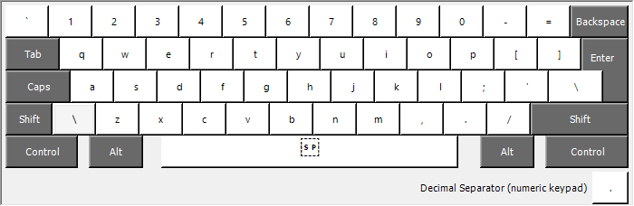
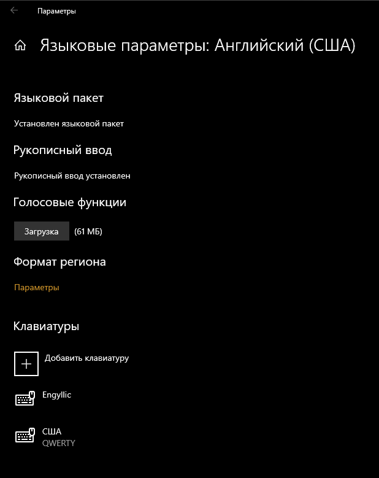

# Что это?

Это две раскладки. Одна для ввода английского на русском, другая - наоборот.

Нужны они, чтобы не переключаться, если нужно вставить текст пару символов или слов в другой раскладке. Они заменяют собой стандартные раскладки Windows.

| _Смотря какой fabric, смотря сколько details._

# Рунглиш

Русско-английская раскладка, не требующая переключения. 
Основная раскладка - Русский (Россия), но с нажатым `AltGr` превращается в Английскую.

Русская раскладка поддерживает все символы английской раскладки. 
Это позволяет не переключать раскладку каждый раз, когда требуется ввести `[`квадратные`]`, или даже `{`фигурные`}` скобки. 

# Англивица

Англо-русская раскладка, в противоположность Рунглишу.
Основная раскладка - Английский (США), но с нажатым `AltGr` превращается в Кириллицу.

## Как пользоваться

Второй язык раскладки вводится с зажатым `AltGr` (правый `Alt`, иногда правый `Alt` + `Ctrl`).

То-есть, с зажатым `AltGr` русская раскладка превращается в английскую:

Если нужно ввести символы в верхнем регистра или спецсимволы, то просто нажимаем `AltGr` + `Shift`:

Всё как при обычном вводе, только с зажатым правым альтом.

## О знаке рубля

Немногие знают, но по умолчанию в русской раскладке `AltGr` + `8` выводит `₽` ([знак рубля](https://support.microsoft.com/ru-ru/topic/%D0%BF%D0%BE%D0%B4%D0%B4%D0%B5%D1%80%D0%B6%D0%BA%D0%B0-%D0%BD%D0%BE%D0%B2%D0%BE%D0%B3%D0%BE-%D1%81%D0%B8%D0%BC%D0%B2%D0%BE%D0%BB%D0%B0-%D1%80%D0%BE%D1%81%D1%81%D0%B8%D0%B9%D1%81%D0%BA%D0%BE%D0%B3%D0%BE-%D1%80%D1%83%D0%B1%D0%BB%D1%8F-microsoft-office-25b7c7df-ea17-4c1e-aefd-158f2cafbc89)).

В этой рунглише его нет, на клавише `8` висит типичная для английской клавиатуры `*`.

# Установка

Запускаем `Setup.exe` из архива. После установки, стандартную раскладку можно смело удалить, при необходимости она легко и просто устанавливается средствами Windows.

# Удаление

Раскладки удаляются, как и любой другой пакет msi, через "Программы и компоненты".

# Известные проблемы

### После удаления клавиатуры США (QWERTY) пропадает языковая панель

Не удаляйте стандартную раскладку "США (QWERTY)". Её надо поставить второй по счёту.
Так, в списке будет две английские клавиатуры, но переключение между ними не потребуется, и всё будет работать.

---

Раскладки разработаны с ипользованием [Microsoft Keyboard Layout Creator (MSKLC) Version 1.4
](https://www.microsoft.com/en-us/download/details.aspx?id=102134)
